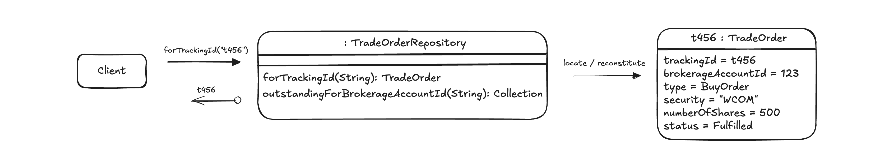
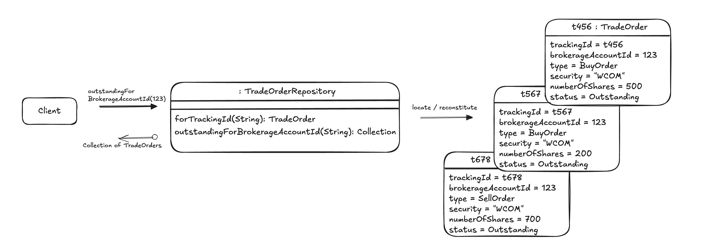

# Contract Test Examples

This repository contains examples of [Contract Tests](https://zalas.pl/contract-test/)
in various programming languages.

## Examples

### Trading

This example is loosely based on the `TradeOrderRepository` found in the "Domain-Driven Design: Tackling Complexity in the Heart of Software"
book by Eric Evans.

Implement the `TradeOrderRepository` with a database storage. The repository should have two methods:

* `forTrackingId(String): TradeOrder` - takes the tracking ID and returns a TradeOrder.
  

* `outstandingForBrokerageAccountId(String): List<TradeOrder>` - takes the brokerage account ID and returns a list of TradeOrders
  

The expected behaviour of `TradeOrderRepository` methods:
* `forTrackingId`
  * returns the TradeOrder if it exists for the given tracking ID
  * returns `null` if the TradeOrder is not found for the given tracking ID (alternatively, expect an exception)
* `outstandingForBrokerageAccountId`
  * returns all outstanding TradeOrders for the given account ID
  * returns an empty list if no TradeOrder was found for the given account ID

<!-- diagrams: https://excalidraw.com/#json=BO8BXplvlraagR_1XPHqN,kpyw34vOoCd64QOgC71_sQ -->

#### Solutions

- [Kotlin](https://github.com/jakzal/contract-test-examples/tree/main/kotlin/trading) | Steps: [Domain Model](https://github.com/jakzal/contract-test-examples/commit/f726ac0a3cbeefb0a1fe02df89382a1b2e823151) > [Integration microtest](https://github.com/jakzal/contract-test-examples/commit/c76b507352c4f45146baf5dbf9ae27196166e93d) > [Extract SUT and fixture creation](https://github.com/jakzal/contract-test-examples/commit/2d1a1659e022cb15c2efe48b1b079b03d9bae894) > [Contract placeholder](https://github.com/jakzal/contract-test-examples/commit/9f4ff1700d535cb8ca341d0e167b979323a88d84) > [Pull test methods up to the contract test](https://github.com/jakzal/contract-test-examples/commit/0db0c950e2b6cbf3563632473b2ba25359c334a7) > [Second adapter](https://github.com/jakzal/contract-test-examples/commit/34f5c32302dc7091ca721b9a96db2bd7b56c3ffc)
- [Kotlin (composition)](https://github.com/jakzal/contract-test-examples/tree/main/kotlin/trading-composition) | Steps: [Domain Model](https://github.com/jakzal/contract-test-examples/commit/7518bccff7b8c08b1422c73fef74e7f676619602) > [Integration microtest](https://github.com/jakzal/contract-test-examples/commit/670ab231d03fe1f6449158dd5af13555c21ac5f4) > [Extract SUT and fixture creation](https://github.com/jakzal/contract-test-examples/commit/441b7129b369046d9d6ede39e381554af57281d5) > [Contract Test](https://github.com/jakzal/contract-test-examples/commit/e8a39b5c30e805f078ee6e6917b94f81113dc277) > [Move the Contract Test](https://github.com/jakzal/contract-test-examples/commit/27917273273481a57436be440878f207c697ccbf) > [Second adapter](https://github.com/jakzal/contract-test-examples/commit/13d7d17f12110ef61d306319927b7bc9f6b2a691)
